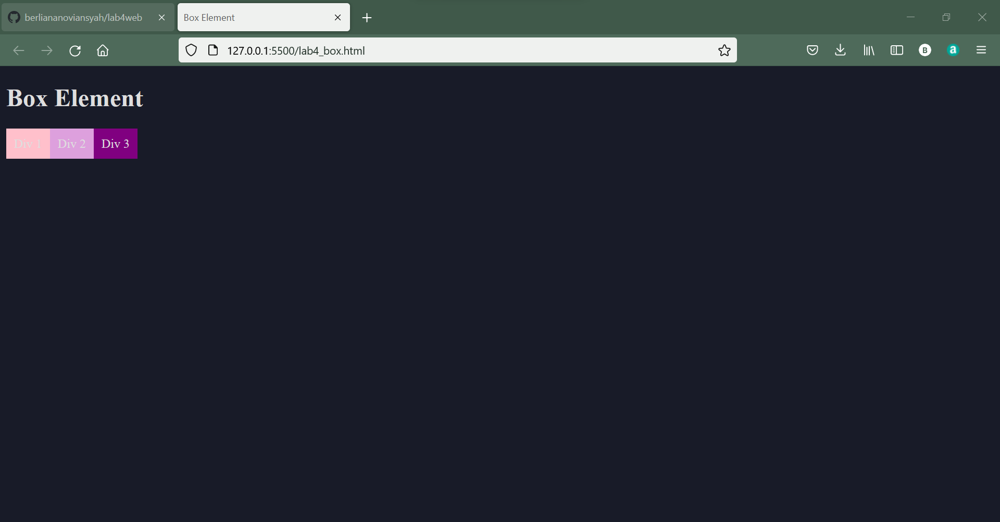
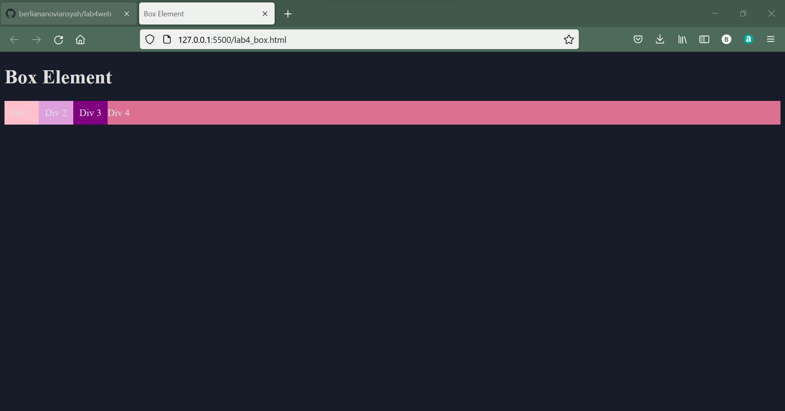
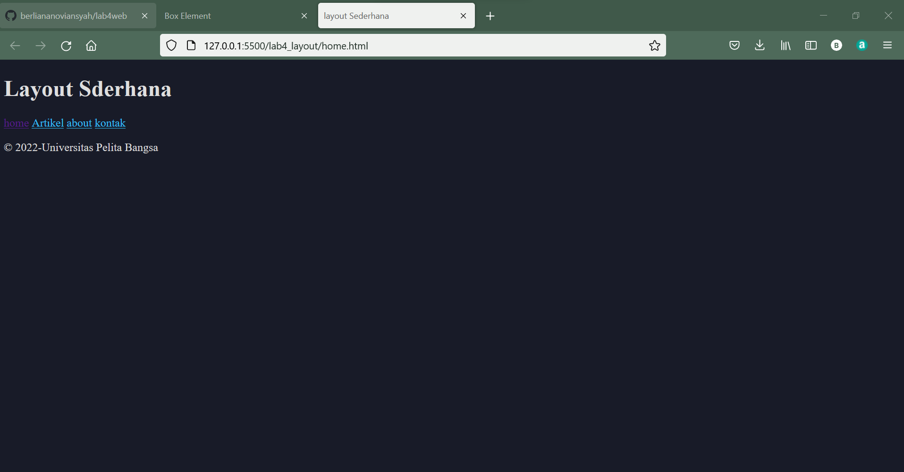
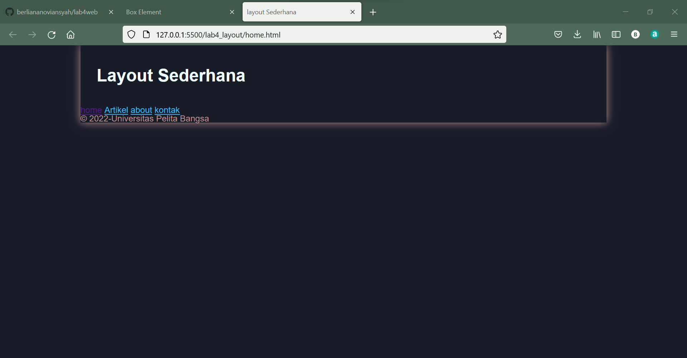

|  Berliana Noviansyah  |     312010373    |
|-----------------------|------------------|
|       TI.20.A1        |  Pemrograan Web  |
|      Praktikum 4      |    Pertemuan 5   |

# Praktikum 4 Pertemuan 5
Pada pertemuan kali ini kita akan membahas bagaimana cara emembuat **Website Layout** dengan property **Float** dan membuat **Box Element**


# 1). Membuat dokumen HTML dengan nama lab_4_box.html

```html
<!DOCTYPE html>
<html lang="en">
<head>
    <meta charset="UTF-8">
    <meta http-equiv="X-UA-Compatible" content="IE=edge">
    <meta name="viewport" content="width=device-width, initial-scale=1.0">
    <title>Box Element</title>
</head>
<body>
    <header>
        <h1>Box Element</h1>
    </header>
</body>
</html>
```


# 2). Membuat Box Element

***code css***
```css
 <style>
        div{
            float: left;
            padding: 10px;
        }
        .div1{
            background: pink;
        }
        .div2{
            background: plum;
        }
        .div3{
            background: purple;
        }
    </style>
```

***code html***
```html
 <section>
        <div class="div1">Div 1</div>
        <div class="div2">Div 2</div>
        <div class="div3">Div 3</div>
    </section>
```

***Hasil outputnya:***

# 3). Mengatur Clearfix Element
 
 Berikut adalah contoh code nya :
 ***code css***
 ```css
 .div4{
            background-color: palevioletred;
            clear: right;
            float: none;
        }
```


***code html***
```html
 <div class="div4">Div 4</div>
 ```

***Dan berikut adalah hasil outputnya:***



**Selanjutnya buatlah folder baru dengan nama lab4_layout, kemudian buatlah file baru didalamnya dengan nama home.html dan file css dengan nama style.css**


# 4). Membuat kerangka layout dengan Semantic Element

**Contoh outputnya adalah sebagai berikut :**




**codingnya:**
```html
<!DOCTYPE html>
<html lang="en">
<head>
    <meta charset="UTF-8">
    <meta http-equiv="X-UA-Compatible" content="IE=edge">
    <meta name="viewport" content="width=device-width, initial-scale=1.0">
    <title>layout Sederhana</title>
    <link rel="stylesheet" href="style.css">
</head>
<body>
    <div id="container">
        <header>
            <h1>Layout Sderhana</h1>
        </header>
        <nav>
            <a href="home.html">home</a>
            <a href="artikel.html">Artikel</a>
            <a href="about.html">about</a>
            <a href="kontak.html">kontak</a>
        </nav>
        <section id="hero"></section>
        <section id="wrapper">
            <section id="main"></section>
            <aside id="sidebar"></aside>
        </section>
        <footer>
            <p>© 2022-Universitas Pelita Bangsa</p>
        </footer>
    </div>
</body>
</html>
```


# 5). Menambahkan File CSS untuk Membuat Layout

**Hasil outputnya sebagai berikut:**




**Dengan hasil output sebagai berikut:**
```css
/* import google font */
@import
url('https://fonts.googleapis.com/css2?family=Open=Sans+ital,wght@0,300;0,400;0,600;0,700;0,800;1,300;1,600;1,700;1,800&display=swap');
@import
url('https://fonts.googleapis.com/css2?family=Open-Sans+Condensed:ital,wght@0,300;0,700;1,300&display=swap');

/* Reset CSS */
*{
    margin: 0;
    padding: 0;
}

body{
    line-height: 1;
    font-size: 100%;
    font-family: 'Open Sans',sans-serif;
    color: rosybrown;
}
#container{
    width: 980px;
    margin: 0 auto;
    box-shadow: 0 0 1em;
}
/* header */
header{
    padding: 20px;
}
header h1{
    margin: 20px 10px;
    color: azure;
}
```


# 6). Membuat Navigasi

**Contoh outputnya sebagai berikut:**


**Coding:**
```css
/* header */
header{
    padding: 20px;
}
header h1{
    margin: 20px 10px;
    color: azure;
}
/* navigasi */
nav{
    display: block;
    background-color: indigo;
}
nav a{
    padding: 15px 30px;
    display: inline-block;
    color: aliceblue;
    font-size: 14px;
    text-decoration: none;
    font-weight: bold;
}
nav a.active,
nav a:hover{
    background-color: plum;
```
