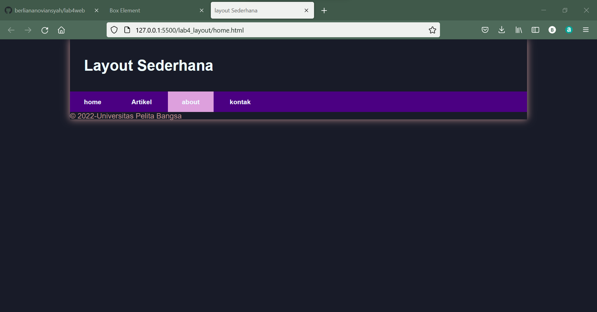
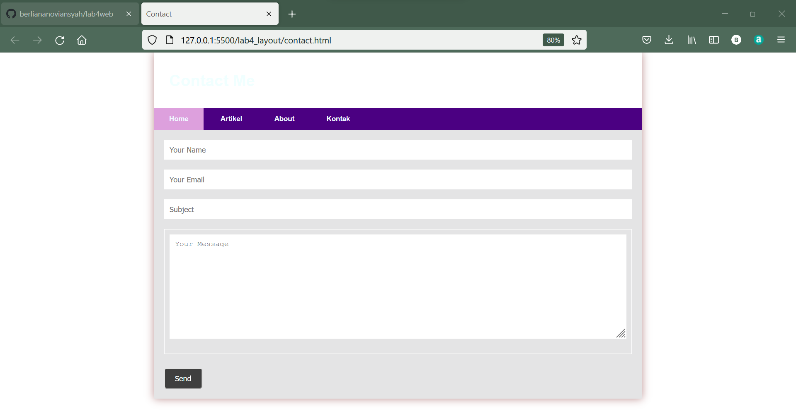

|  Berliana Noviansyah  |     312010373    |
|-----------------------|------------------|
|       TI.20.A1        |  Pemrograan Web  |
|      Praktikum 4      |    Pertemuan 5   |

# Praktikum 4 Pertemuan 5
Pada pertemuan kali ini kita akan membahas bagaimana cara emembuat **Website Layout** dengan property **Float** dan membuat **Box Element**


# 1). Membuat dokumen HTML dengan nama lab_4_box.html

```html
<!DOCTYPE html>
<html lang="en">
<head>
    <meta charset="UTF-8">
    <meta http-equiv="X-UA-Compatible" content="IE=edge">
    <meta name="viewport" content="width=device-width, initial-scale=1.0">
    <title>Box Element</title>
</head>
<body>
    <header>
        <h1>Box Element</h1>
    </header>
</body>
</html>
```


# 2). Membuat Box Element

***code css***
```css
 <style>
        div{
            float: left;
            padding: 10px;
        }
        .div1{
            background: pink;
        }
        .div2{
            background: plum;
        }
        .div3{
            background: purple;
        }
    </style>
```

***code html***
```html
 <section>
        <div class="div1">Div 1</div>
        <div class="div2">Div 2</div>
        <div class="div3">Div 3</div>
    </section>
```

***Hasil outputnya:***

# 3). Mengatur Clearfix Element
 
 Berikut adalah contoh code nya :
 ***code css***
 ```css
 .div4{
            background-color: palevioletred;
            clear: right;
            float: none;
        }
```


***code html***
```html
 <div class="div4">Div 4</div>
 ```

***Dan berikut adalah hasil outputnya:***


**Selanjutnya buatlah folder baru dengan nama lab4_layout, kemudian buatlah file baru didalamnya dengan nama home.html dan file css dengan nama style.css**


# 4). Membuat kerangka layout dengan Semantic Element

**Contoh outputnya adalah sebagai berikut :**


**codingnya:**
```html
<!DOCTYPE html>
<html lang="en">
<head>
    <meta charset="UTF-8">
    <meta http-equiv="X-UA-Compatible" content="IE=edge">
    <meta name="viewport" content="width=device-width, initial-scale=1.0">
    <title>layout Sederhana</title>
    <link rel="stylesheet" href="style.css">
</head>
<body>
    <div id="container">
        <header>
            <h1>Layout Sderhana</h1>
        </header>
        <nav>
            <a href="home.html">home</a>
            <a href="artikel.html">Artikel</a>
            <a href="about.html">about</a>
            <a href="kontak.html">kontak</a>
        </nav>
        <section id="hero"></section>
        <section id="wrapper">
            <section id="main"></section>
            <aside id="sidebar"></aside>
        </section>
        <footer>
            <p>© 2022-Universitas Pelita Bangsa</p>
        </footer>
    </div>
</body>
</html>
```


# 5). Menambahkan File CSS untuk Membuat Layout

**Hasil outputnya sebagai berikut:**


**Dengan hasil output sebagai berikut:**
```css
/* import google font */
@import
url('https://fonts.googleapis.com/css2?family=Open=Sans+ital,wght@0,300;0,400;0,600;0,700;0,800;1,300;1,600;1,700;1,800&display=swap');
@import
url('https://fonts.googleapis.com/css2?family=Open-Sans+Condensed:ital,wght@0,300;0,700;1,300&display=swap');

/* Reset CSS */
*{
    margin: 0;
    padding: 0;
}

body{
    line-height: 1;
    font-size: 100%;
    font-family: 'Open Sans',sans-serif;
    color: rosybrown;
}
#container{
    width: 980px;
    margin: 0 auto;
    box-shadow: 0 0 1em;
}
/* header */
header{
    padding: 20px;
}
header h1{
    margin: 20px 10px;
    color: azure;
}
```


# 6). Membuat Navigasi

**Contoh outputnya sebagai berikut:**




**Coding:**
```css
/* header */
header{
    padding: 20px;
}
header h1{
    margin: 20px 10px;
    color: azure;
}
/* navigasi */
nav{
    display: block;
    background-color: indigo;
}
nav a{
    padding: 15px 30px;
    display: inline-block;
    color: aliceblue;
    font-size: 14px;
    text-decoration: none;
    font-weight: bold;
}
nav a.active,
nav a:hover{
    background-color: plum;
```


# 7). Membuat Hero Panel

**Codingnya CSS nya adalah sebagai berikut:**
```css
/* Hero Panel */
#hero{
    background-color: thistle;
    padding: 50px 20px;
    margin-bottom: 20px;
}
#hero h1{
    margin-bottom: 20px;
    font-size: 35px;
}
#hero p{
    margin-bottom: 20px;
    font-size: 18px;
    line-height: 25px;
}
```

**Coding html nya:**
```html
 <section id="hero">
            <h1>Hello World</h1>
            <p>Lorem ipsum dolor sit amet, consectetur adipiscing elit. Vestibulum lorem
                elit, iaculis innisl volutpat, malesuada tincidunt arcu. Proin in leo fringilla,
                vestibulum mi porta, faucibus felis. Integer pharetra est nunc, nec pretium nunc
                pretium ac.</p>
                <a href="home.html" class="btn btn-large">Learn More >></a>
        </section>
```

**Dan dengan hasil output sebagai berikut:**


# 8). Mengatur Layout Main dan SIdebar

**Code CSS:**
```css
/* Main Content */
#wrapper{
    margin: 0;
}
#main{
    float: left;
    width: 640px;
    padding: 20px;
}
/* Sidebar Area */
#sidebar{
    float: left;
    width: 260px;
    padding: 20px;
}
```


# 9). Membuat Sidebar Widget

**Hasil Outputnya adalah:**


**Dengan Coding CSS:**
```css
/* Widget */
.widget-box{
    border: 1px solid aliceblue;
    margin-bottom: 20px;
}
.widget-box .title{
    padding: 10px 16px;
    background-color: rgb(195, 68, 195);
    color: lavender;
}
.widget-box ul{
    list-style-type: none;
}
.widget-box li{
    border-bottom: 1px solid aliceblue ;
}
.widget-box li a{
    padding: 10px 16px;
    color: darkslategray;
    display: block;
    text-decoration: none;
}
.widget-box li:hover a{
    background-color: aliceblue;
}
.widget-box p{
    padding: 15px;
    line-height: 25px;
}
```

**Coding HTML:**
```html
 <aside id="sidebar">
        <div class="widget-box">
            <h3 class="title">widget Header</h3>
            <ul>
                <li><a href="#">Widget Link</a></li>
                <li><a href="#">Widget Link</a></li>
                <li><a href="#">Widget Link</a></li>
                <li><a href="#">Widget Link</a></li>
                <li><a href="#">Widget Link</a></li>
            </ul>
        </div>
        <div class="widget-box">
            <h3 class="title">Widgwt Text</h3>
            <p>Vestibulum lorem elit, iaculis in nisl volutpat, malesuada tincidunt
                arcu. Proin in leo fringilla, vestibulum mi porta, faucibus felis. Integer
                pharetra est nunc, nec pretium nunc pretium ac.</p>
        </div>
    </aside>
```


# 10). Mengatur Footer

**Hasil outputnya adalah sebagai berikut:**


**Coding:**
```css
/* Footer */
footer{
    clear: both;
    background-color: purple;
    padding: 20px;
    color: aliceblue;
}
```

# 11). Menambahkan Element Lain pada Main Content

**Outputnya:**


**Coding CSS nya adalah sebagai berikut:**
```css
/* Box */
.box{
    display: block;
    float: left;
    width: 33.3333333%;
    box-sizing: border-box;
    -moz-box-sizing: border-box;
    -webkit-box-sizing: border-box;
    padding: 0 10px;
    text-align: center;
}
.box h3{
    margin: 15px 0;
}
.box p{
    line-height: 20px;
    font-size: 14px;
    margin-bottom: 15px;
}
box img{
    border: 0;
    vertical-align: middle;
}
.image-circle{
    border-radius: 50%;
}
.row{
    margin: 0 -10px;
    box-sizing: border-box;
    -moz-box-sizing: bordeer-box;
    -webkit-box-sizing: border-box;
}
.row::after, .row::before;
.entry::after, .entry::before{
    content: '';
    display: table;
}
.row::after,
.entry::after{
    clear: both;
}
```

**Dan coding HTML nya adalah sebagai berikut:**
```html
  <section id="main">
            <div class="row">
                <div class="box">
                    
                    <h3>Heading</h3>
                    <p>Donec sed odio dui. Etiam porta sem malesuada magna mollis
                        euismod.</p>
                    <a href="#" class="btn btn-default">View detail</a>
                </div>
                <div class="box">
                    
                    <h3>Heading</h3>
                    <p>Donec sed odio dui. Etiam porta sem malesuada magna mollis euismod.</p>
                    <a href="#" class="btn btn-default">View detail</a>
                </div>
                <div class="box">
                    
                    <h3>Heading</h3>
                    <p>Donec sed odio dui. Etiam porta sem malesuada magna mollis euismod.</p>
                    <a href="#" class="btn btn-default">View detail</a>
                </div>
            </div>
</section>
```

# 12). Menambahkan Content Artikel pada Main Content

**Berikut adalah contoh coding HTML nya:**
```html
                <hr class="divider">
                <article class="entry">
                    <h2>First featurette heading</h2>
                    
                    <p>Lorem ipsum dolor sit amet, consectetur adipiscing elit. Vestibulum lorem
                        elit, iaculis in nisl volutpat, malesuada tincidunt arcu. Proin in leo fringilla,
                        vestibulum mi porta, faucibus felis. Integer pharetra est nunc, nec pretium nunc
                        pretium ac.</p>
                </article>
                <hr class="divider">
                <article class="entry">
                    <h2>First featurette heading</h2>
                    
                    <p>Lorem ipsum dolor sit amet, consectetur adipiscing elit. Vestibulum lorem
                        elit, iaculis in nisl volutpat, malesuada tincidunt arcu. Proin in leo fringilla,
                        vestibulum mi porta, faucibus felis. Integer pharetra est nunc, nec pretium nunc
                        pretium ac.</p>
                </article>
```

**Coding CSS:**
```css
/* entry */
.entry{
    margin: 15px 0;
}
.entry h2{
    margin-bottom: 20px;
}
.entry img{
    float: left;
    border-radius: 5px;
    margin-right: 15px;
}
.entry .right-img{
    float: right;
}
```

**Berikut adalah outputnya:**


# Pertanyaan dan Tugas

# 1). Tambahkan Layout untuk Menu About

Tambahkan file di dalam folder lab4_layout dengan nama about.html, lalu masukan codingan sebagai berikut :
```html
<!DOCTYPE html>
<html lang="en">
<head>
    <meta charset="UTF-8">
    <meta http-equiv="X-UA-Compatible" content="IE=edge">
    <meta name="viewport" content="width=device-width, initial-scale=1.0">
    <title>About Me</title>
    <link rel="stylesheet" href="style.css">
</head>
<body>
    <div id="container">
        <header>
            <h1>About Me</h1>
        </header>
        <nav>
            <a href="home.html" class="active">Home</a>
            <a href="artikel.html">Artikel</a>
            <a href="about.html">About</a>
            <a href="kontak.html">Kontak</a>
        </nav>
        <section id="about">
            <div class="row">
                
                <h1>Berliana Noviansyah</h1>
                <p>Nama saya Berliana Noviansyah, Saya adalah seorang mahasiswa di Universitas Pelita Bangsa, Program Studi Teknik Informatika. Saya lahir di Bekasi, 06 September 2002.</p>
            </div>
        </section>
        <footer>
            <p style="text-align: center;">@BERLIANA</p>
        </footer>
    </div>
</body>
</html>
```

**Code CSS:**
```css
/* About Panel */
#about{
    background-color: #e4e4e5;
    padding: 50px 20px;
    margin-bottom: 20px;
}
#about h1{
    margin-bottom: 10px;
    font-size: 35px;
    position: relative;
    left: 15px;
}
#about p{
    margin-bottom: 20px;
    font-size: 18px;
    padding: 30px;
    line-height: 25px;
    position: relative;
    left: 15px;
```

**Dengan Hasil sebagai berikut:**


# 2). Tambahkan Layout yang Berisi Menu Contact

Buat file html baru dengan nama contact.html dan buat form yang berisi nama, email, message, dll.

**Berikut adalah contoh coding pada HTML**
```html
<!DOCTYPE html>
<html lang="en">
<head>
    <meta charset="UTF-8">
    <meta http-equiv="X-UA-Compatible" content="IE=edge">
    <meta name="viewport" content="width=device-width, initial-scale=1.0">
    <title>Contact</title>
    <link rel="stylesheet" href="style.css">
</head>
<body>
    <div id="container">
        <header>
            <h1>Contact Me</h1>
        </header>
        <nav>
            <a href="home.html" class="active">Home</a>
            <a href="artikel.html">Artikel</a>
            <a href="about.html">About</a>
            <a href="kontak.html">Kontak</a>
        </nav>
        <section id="kontak">
            <div class="login">
               <input type="text" placeholder="Your Name" class="input">
               <input type="text" placeholder="Your Email" class="input">
            </div>
            <div class="subject">
                <input type="text" placeholder="Subject" class="input"> 
            </div>
            <div class="msg">
                <textarea name="Message" id="Message" cols="35" rows="10" class="area" class="input" placeholder="Your Message"></textarea>
            </div>
            <button type="submit">Send</button>
        </section>
    </div>
</body>
</html>
```

**Coding CSS**
```css
/* Kontak Panel */
#Kontak{
    background-color: #e4e4e5;
    padding: 20px 20px;
    margin-bottom: 20px;
}
.input,
.msg, .area{
    width: 100%;
    padding: 10px;
    border: 1px solid white;
    box-sizing: border-box;
    font-size: 15px;
    margin-bottom: 20px;
}
button{
    font-size: 15px;
    background-color: #3f3f3f;
    color: white;
    border-radius: 5px;
    padding: 10px 20px;
    margin-top: 8px;
}
button:hover{
    opacity: 0,9;
    background-color: #1f5faa;
}
```


**Dengan hasil sebagai berikut**

